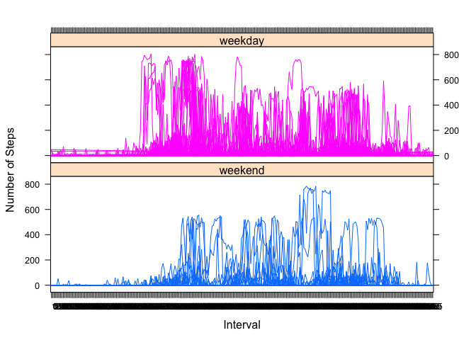

# Reproducible Research: Peer Assessment 1
bcoke  
June 7, 2015  
###Loading and Preprocessing the Data

First download the file:

```r
temp = tempfile()
URL = "https://d396qusza40orc.cloudfront.net/repdata%2Fdata%2Factivity.zip"
download.file(URL, temp, mode="wb", method = "curl")
unzip(temp, "activity.csv")
activity <- read.table("activity.csv", sep=",",skip=2, header=T)
rm(URL, temp)
```

Then add labels:

```r
labels <- c("steps", "date", "interval")
colnames(activity) <- labels
rm(labels)
```

###What is mean total number of steps taken per day?


```r
x <- tapply(activity$steps, INDEX = activity$date, sum)
meanStepsByDate <- as.vector(x)
#create histogram
hist(meanStepsByDate, col = "red")
```

 

Calculate and report the mean and median total number of steps taken per day


```r
good <- which(!is.na(meanStepsByDate))
meanStepsByDate <- meanStepsByDate[good]
mean(meanStepsByDate)
```

```
## [1] 10766.19
```

```r
median(meanStepsByDate)
```

```
## [1] 10765
```

The mean total number of steps taken per day is 10766 steps.
The median total number of steps taken per day is 10765 steps.

##What is the average daily activity pattern?

Make a time series plot (i.e. type = "l") of the 5-minute interval (x-axis) and the average number of steps taken, averaged across all days (y-axis)


```r
library(lattice)
xyplot(activity$steps ~ activity$interval, dat = activity, type = "l", xlab = "Interval", ylab = "Number of Steps")
```

 

Which 5-minute interval, on average across all the days in the dataset, contains the maximum number of steps?


```r
max(activity$steps, na.rm = TRUE)
```

```
## [1] 806
```

```r
which(activity$steps == "806")
```

```
## [1] 16490
```

```r
activity[16490,]
```

```
##       steps       date interval
## 16490   806 2012-11-27      615
```

Interval number 615 contains the maximum number of steps. 

##Imputing missing values

Note that there are a number of days/intervals where there are missing values (coded as NA). The presence of missing days may introduce bias into some calculations or summaries of the data.

Calculate and report the total number of missing values in the dataset (i.e. the total number of rows with NAs)


```r
length(which(is.na(activity)))
```

```
## [1] 2302
```

Devise a strategy for filling in all of the missing values in the dataset. The strategy does not need to be sophisticated. For example, you could use the mean/median for that day, or the mean for that 5-minute interval, etc.

In order to fill in the missing values in the dataset, I decided to convert the class of the activity data frame into zoo (Z's Ordered Observations) using the "zoo" package. I use the na.locf (last observation carried forward) function in order to fill in the missing values. In order to use this function, you cannot have a column that starts with NA (or you have nothing to carry forward), so I start by filling in the first day obsevations by copying and pasting the data from day 2. Then I use the locf function to fill in the rest of the dataset.


```r
activity2 <- activity
day2 <- activity[287:573, 1]
activity2[1:287, 1] <- day2

library(zoo)
```

```
## 
## Attaching package: 'zoo'
## 
## The following objects are masked from 'package:base':
## 
##     as.Date, as.Date.numeric
```

```r
z <- zoo(activity2)
z2 <- na.locf(z)
z3 <- as.data.frame(z2)

#converting the steps column into numeric
z4 <- as.numeric(as.character(z3$steps))
z3$steps <- z4
```


Create a new dataset that is equal to the original dataset but with the missing data filled in.

z3 is the new dataset with missing data filled in.

Make a histogram of the total number of steps taken each day and Calculate and report the mean and median total number of steps taken per day. Do these values differ from the estimates from the first part of the assignment? What is the impact of imputing missing data on the estimates of the total daily number of steps?


```r
x <- tapply(z3$steps, INDEX = z3$date, sum)
meanStepsByDate2 <- as.vector(x)
#create histogram
hist(meanStepsByDate2, col = "red")
```

 

##Calculate and report the mean and median total number of steps taken per day


```r
mean(meanStepsByDate2)
```

```
## [1] 9356.295
```

```r
median(meanStepsByDate2)
```

```
## [1] 10395
```


##Are there differences in activity patterns between weekdays and weekends?

Create a new factor variable in the dataset with two levels -- "weekday" and "weekend" indicating whether a given date is a weekday or weekend day.

Make a panel plot containing a time series plot (i.e. type = "l") of the 5-minute interval (x-axis) and the average number of steps taken, averaged across all weekday days or weekend days (y-axis).


```r
z3$date <- as.Date(z3$date)
weekdays <- c("Monday", "Tuesday", "Wednesday", "Thursday", "Friday")
weekend <- c("Saturday", "Sunday")
z3$day <- factor((weekdays(z3$date) %in% weekdays)+1L,
                             levels=1:2, labels=c('weekend', 'weekday'))
library(lattice)
xyplot(z3$steps ~ z3$interval | z3$day, groups = z3$day, dat = z3, type = "l", layout = c(1,2), xlab = "Interval", ylab = "Number of Steps")
```

 


Looking at this plot, we can see that on weekdays, our subject is active earlier in the day and seems to have an overall higher number of steps taken.
